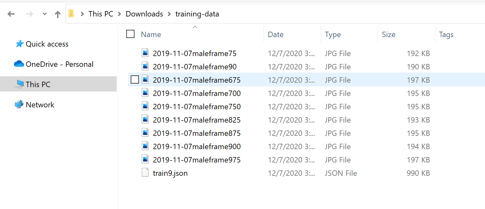
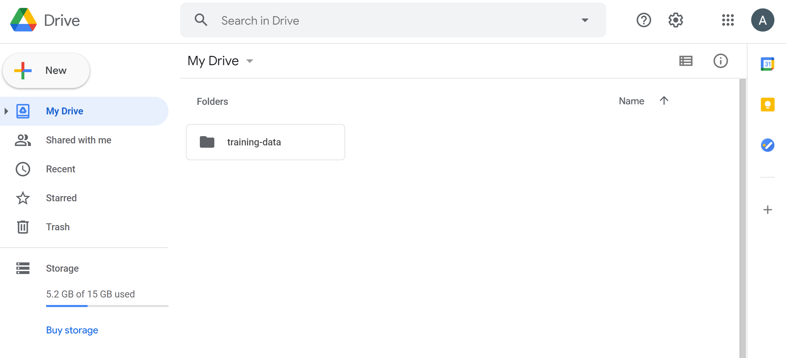
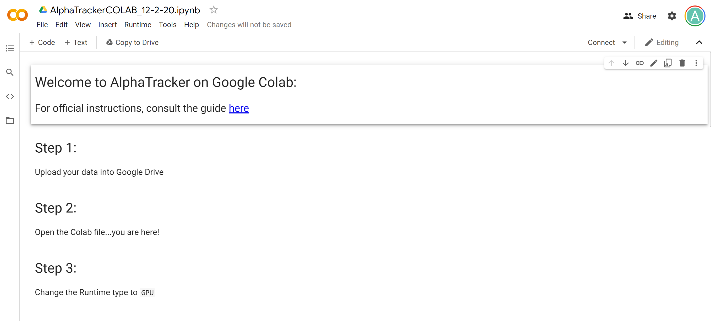
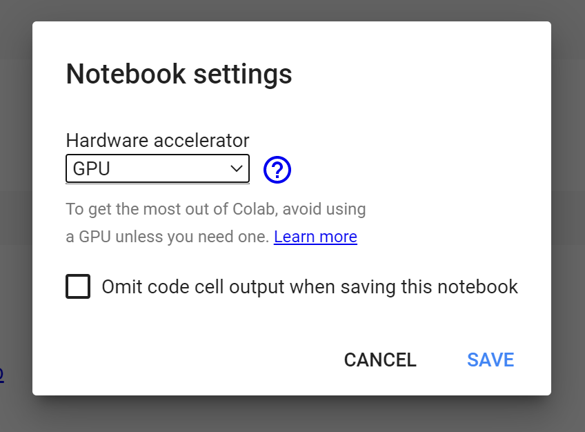
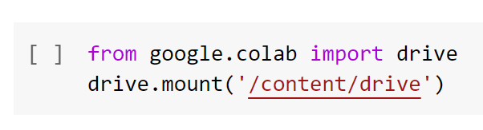
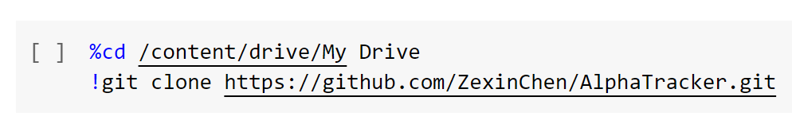
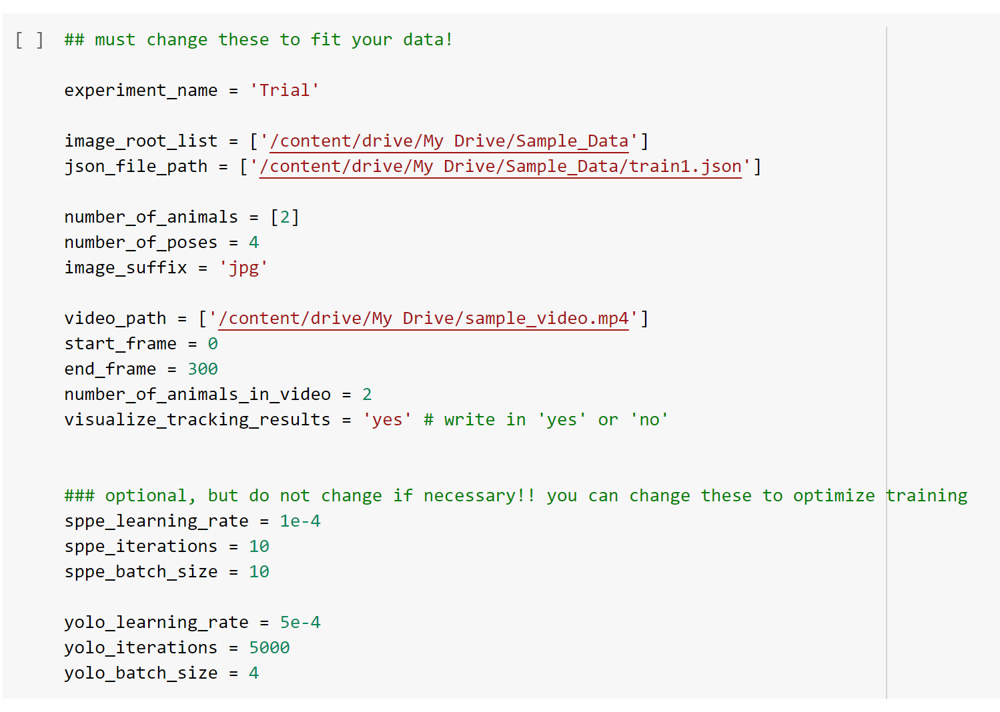
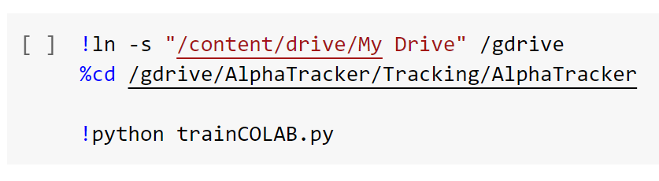
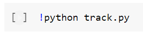

# Tracking with Colab

AlphaTracker is tested in Linux systems broadly and those systems that have GPUs. However, if you would do not have Linux-compatible system or do not have access to consumer GPUs, you can use Google Colab for the purposes of training and tracking Alphatracker!

## Before You Continue:

The training of AlphaTracker requires human annotated data. Depending on whether your videos resemble ours, you may choose one of the following approaches:

### Train with your own annotated data:

You can annotate your own data with the AlphaTracker Annotation Tool we provided before proceeding to the training phase.

To access the Colab notebook, **click [here](https://colab.research.google.com/drive/1SE3NpoTOjZqt8AftP5taNCQ8efWUanQW?usp=sharing)**

###  Train with our annotated data:

Alternatively, if your images resemble ours (background, mouse appearance, shooting angle), you can use the annotated dataset we provide. Click [here](https://drive.google.com/drive/folders/1Dk6e7sJ-dtT3L26r2Tw2QeiQSkn1DAfs?usp=sharing) to download this data. 

To access the Colab notebook, **click [here](https://colab.research.google.com/drive/1SE3NpoTOjZqt8AftP5taNCQ8efWUanQW?usp=sharing)**

### Test without training:

We also provide pre-trained model which allows users to skip training. This promises good performance if your videos resemble ours (background, mouse appearance, shooting angle).

To access the Colab notebook, click [this link](https://colab.research.google.com/drive/1KOQy1ij6aClW5rmygSxoUVIKpLNcjo1x?usp=sharing)**

 

Note: If the number of animals are different across the JSON files, you need to run each separately.

 

## Step 1:

Find your folder/folders of data that contain the training images and the JSON annotated files. In this sample folder called `training-data`, there are 9 images alongside 1 json file that contains the image labels.  

    

  

Open your Google Drive, and upload the folder/folders, and the videos you want to label, into the Drive under the main `My Drive` folder as shown in the image below. Ensure that your Drive has ample storage after uploading the files!!

    

  

## Step 2: 

Open the `AlphaTrackerCOLAB_12-2-20.ipynb`, which can be found at this [link here](https://colab.research.google.com/drive/1SE3NpoTOjZqt8AftP5taNCQ8efWUanQW?usp=sharing). You should see a page like the one in the image below. 

    

 

## Step 3:

Click `Runtime` and then `Change runtime type`. From the dropdown menu, select `GPU`. 

    

 

## Step 4: 

Now, we will connect our Python session to our Google Drive. Press the play button next to the code block to run the first cell. You will be prompted with an authorization link. Click this link and follow the instructions. Select the Google Drive account to which you have uploaded your data from `Step 1`. Paste the authorization code back into the prompt box. 

Run the second code block. **This is an important note**: The main `My Drive` folder has the following path: `/content/drive/My Drive`. We are now inside this main folder

    

 

## Step 5:

Run the following code block to download `AlphaTracker` into your Google Drive. Wait a minute or two, then go to your `My Drive` folder. You should notice a new folder by the name `AlphaTracker` has appeared. 

    

 

## Step 6:

In the following code block, enter in the variables that will define your experiment. **Very important: Ensure that your training data for a specific experiment has the same number of animals and poses. If there are samples with different numbers, please separate them as run them with different experiment names!**

In `experiment_name`, type in the name for the experiment inside the quotation marks. 

In the following code block, in the variable `image_root_list`, enter the path to all your image folders. 

In the variable `json_path_list`, enter the path to all the respective JSON training files in the same order as the image folders in `image_root_list`. 

In `number_of_animals`, enter in the number of animals in each of the JSON files inside the brackets.

In `number_of_poses`, enter in the number of bodyparts that are being labeled per animal. 

In `image_suffix`, enter the extension of the image, such as "jpg", or "png".

In `video_path`, enter in the path of where the videos to-be-tracked are located. 

In `start_frame`, enter in the first frame of the video that you would like to label.

In `end_frame`, enter in the last frame of the video that you would like to label. 

In `number_of_animals_in_video`, enter in the number of animals in the video. 

In `visualize_tracking_results`, enter in either 'yes' or 'no' if you would like to visualize the tracking results. 

**The following are optional, but can be changed**

In `sppe_learning_rate`, type in the learning rate for the SPPE model. 

In `sppe_iterations`, type in the number of iterations for the SPPE model. 

In `sppe_batch_size`, type in the batch size for the SPPE model. 

In `yolo_learning_rate`, type in the learning rate for the YOLO model.

In `yolo_iterations`, type in the number of iterations for the YOLO model.

In `yolo_batch_size`, type in the batch size for the YOLO model. 

**Remember, the main `My Drive` folder has the path `/content/drive/My Drive`, therefore, a folder named `Images` that is under the main `My Drive` folder would have the path `/content/drive/My Drive/Images`. This is what you should type. For example, `image_root_list = ['/content/drive/My Drive/Folder1', '/content/drive/My Drive/Folder2']` and etc...**

 

    

 

## Step 7: 

Run the following code blocks back-to-back without any alterations. This will take about 6-10 minutes to complete!

    

 

## Step 8:

Run the following code block to train AlphaTracker! This step can take anywhere from 30 minutes to 6 hours. It depends on how many iterations you are training for.

    

 

## Step 9:

Run the following code block to perform tracking on the videos you listed in `setting.py`. Once this step is complete, you can go to the folder you designated in the `result_folder` variable in `setting.py` to find the location of the tracked results!

    

