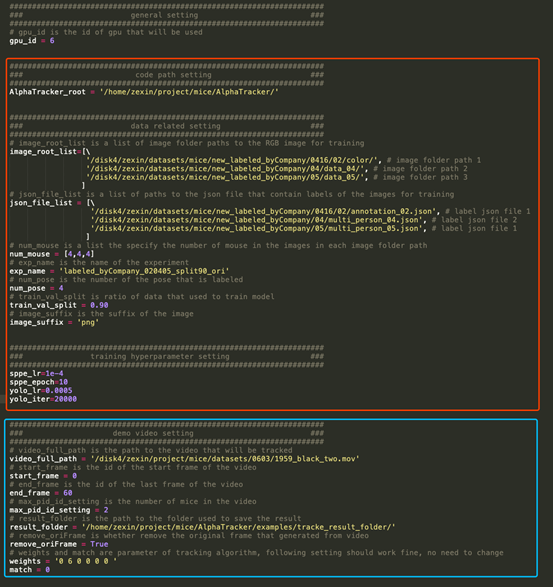

# 01 Tracking

## Preparation

Download the AlphaTracker repository. Once downloaded, change the name of the main folder from `AlphaTracker-master` to `AlphaTracker`. 

### Install conda

This project is tested in conda env and thus conda is recommended. To install conda, please follow the instructions from the [conda website](https://docs.conda.io/projects/conda/en/latest/user-guide/install/index.html) With conda installed, please set up the environment with the following steps.

### Install conda environment

In your command window, type in "anaconda prompt". Open this application. Then, find the folder that contains the `AlphaTracker` repository that you just downloaded. Then inside the Anaconda Prompt, change the directory as follows: `cd /path/to/AlphaTracker`. 

1. Create conda enviroment with dependencies by typing in the following:

```bash
conda env create -f environment.yml
```

If the above command line failed, please install the packages in the environment.yml that are failed to install manually and then run the following command line:

```bash
conda activate alphatracker
conda env update --file environment.yml
```
2. install pytorch following the guide from [Pytorch Website](https://pytorch.org/get-started/previous-versions/).

(The code is tested with pytorch 0.4.0, pytorch 0.4.1)


### Install YOLO

Install [YOLO](https://pjreddie.com/darknet/yolo/) for training by copy-pasting the following into the Anaconda Prompt.
```bash
cd ./Tracking/AlphaTracker/train_yolo/darknet/
make
cd ../../../../
```

### Download weights 

Download files from google drive and place them in specific locations by copy-pasting the following into the Anaconda Prompt:
```bash
conda activate alphatracker
cd ./Tracking/AlphaTracker/
python3 download.py
```

<br>

## Tracking

### Step 1. Configuration

Before tracking, you need to change the parameters in ./Tracking/AlphaTracker/setting.py (blue block in Figure 2). The meaning of
the parameters can be found in the ./Tracking/AlphaTracker/setting.py.

The default ./Tracking/AlphaTracker/setting.py will use a trained weight to track a demo video

### Step 2. Running the code

Use the following command line to train the model...copy paste the following into the Anaconda Prompt:
```bash
conda activate alphatracker
cd ./Tracking/AlphaTracker/
python train.py
```

Use the following command line to track your videos after training...copy paste the following into the Anaconda Prompt:
```bash
python track.py
```


<br>

### General Notes about the Parameters:
1. Remember not to include any spaces or parentheses in your file names
2. For training the parameter num_mouse must include the same number of items as the number of json files
that have annotated data. For example if you have one json file with annotated data for 3 animals then
```num_mouse=[3]``` if you have two json files with annoted data for 3 animals then ```num_mouse=[3,3]```.
3. ```sppe_lr``` is the learning rate for the SAPE network. If your network is not performing well you can lower this
number and try retraining
4. ```sppe_epoch``` is the number of training epochs that the SAPE network does. More epochs will take longer but
can potentially lead to better performance.

<br>


## Training

### Step 1. Data Preparation

Labeled data is required to train the model. The code would read RGB images and json files of
annotations to train the model. Our code is compatible with data annotated by the open source tool Sloth.
Figure 1 shows an example of annotation json file. In this example, there only two images. Each image
has two mice and each mouse has two keypoint annotated.
<div align="center">
    <br>
    Figure 1. Example of Annotation Json File
</div>

**Note** that point order matters. You must annotate all body parts in the same order for all frames. For
example, all the first points represent the nose, all the second points represent the tail and etc.
If the keypoint is not visible in one frame, then make the x,y of the keypoint to be -1.

### Step 2. Configuration

Before training, you need to charge the parameters in ./setting.py (red block in Figure 2). The meaning of the parameters can be found in the ./setting.py.
<div align="center">
    <br>
    Figure 2. Parameters
</div>

### Step 3. Running the code

Change directory to the alphatracker folder (where this README is in) and use the following command line to train the model:
```bash
conda activate alphatracker
python train.py
```

<br>


