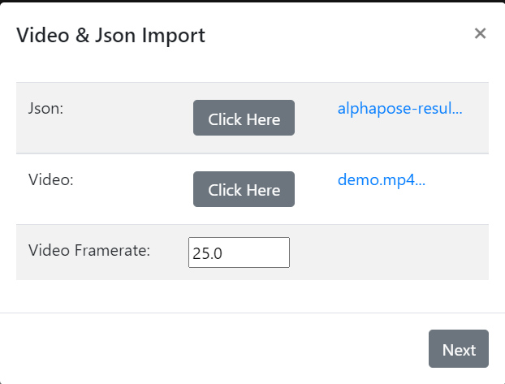

# 03 Tracking UI and Clustering UI

This interface is browser-based. We recommend using `Chrome` as the browser. 

Pre-installed Python3 is required since this package includes Python scripts.

### Installation 

Download and unzip the file.

### Running

Run `server.py` script in command window in the unzipped folder. A window should appear in the user's browser. From there, select a program you want to run.

 
    
## Tracking UI

### Import data

- Click the first `Click Here` button to upload JSON file.

- Click the second `Click Here`button to upload the video.

- Specify the frame rate of the imported video. *The default frame rate value is* `29.95`.
 
    
 
  
 
### User interface

The functions of each element in the toolbar is explained by the numerical order shown in the figure.

#### I. Navigation Bar

    - 1.1 Tracking: Link to the Curate UI.
    - 1.2 Behavior: Link to the Cluster UI.
    - 1.3 Help: Link to the Operation Manual.
    - 1.4 Export: Saves the current clip information as a local `.json` file.
    - 1.5 New Session: Prompts user to import new files and start a new session. **Beware:** If the user chooses to create a new session, all unsaved progress will be lost.
    - 1.6 Undo Button
    - 1.7 Redo Button

#### II. Operation Area
    - 2.1 Video Player: Dots of different color groups represents skeletal points of an individual identity. Such dots can be directly interacted with by simply dragging with the cursor to a new location.
    - 2.2 Jump To: Jump to a specific frame of the video.
    - 2.3 Curate: Curates an interval designated by function 3.5.
    - 2.4 Reassign Identity
    - 2.5 Operation Log
    - 2.6 Real-time Strip Line Update On/Off: Due to existing play-back performance issues of the CanvasJS API, the real-time strip line update is by default set to off. The action of turning on real-time update while working with long videos is strongly discouraged since it will slow down your playback perfomance.

####  III. Toolbar
    - 3.1 Play Button
    - 3.2 Time/Frame Position
    - 3.3 Frame Control: By clicking the corresponding button, the user can fast forward/roll back the video by a single frame.
    - 3.4 Second Control: By clicking the corresponding button, the user can fast forward/roll back the video by a single second.
    - 3.5 Set Interval: IN button designates the start of the interval while the OUT button designates the end.
    - 3.6 Playback Speed

#### IV. Progress Bar and Line Chart
    - 4.1 Progress Bar
    - 4.2 Line Chart&View Options: By clicking the text-box under identity tags, a drop-down menu will appear and let the user to choose from view options listed below:
        - 4.2.1 Box: As shown in the figure below.
        - 4.2.2 Point 1-4: Views the individual dots of an identity. The point score is hidden by default, the user can view the score by interacting with the chart legends.
        - 4.3.3 Score

 

##  Cluster UI

### Import Data
To  import data from Alphatracker clustering, follow the instructions shown on corresponding pop-ups.

- Step 1: 

    

- Step 2: Specify the frame rate of the imported video. *The default frame rate value is* `30`.

    

- Step 3: 

    

 

### User interface

The functions of each element in the toolbar is explained by the numerical order shown in the figure.

#### I. Navigation Bar
            - 1.1 Tracking: Link to the Curate UI.
            - 1.2 Behavior: Link to the Cluster UI.
            - 1.3 Help: Link to the Operation Manual.
            - 1.4 Export: Saves the current dendrogram as a local `.json` file.
            - 1.5 New Session: Prompts user to upload new files and start a new session. **Beware:** If the user chooses to create a new session, all unsaved progress will be lost.
            - 1.6 Undo Button
            - 1.7 Redo Button

#### II. Operation Area
            - 2.1 Video Player
            - 2.2 Dendrogram: Displays the content of the uploaded dendrogram description     file. Double-clicking a node(be it clip or cluster) would highlight all the frames contained in the node.
                - 2.2.1 Right Click Menu
                    - 2.2.1.1 Move: Place the current cluster or clip node under the targeted cluster. 

                    - 2.2.1.2 Rename: Rename the current cluster. 

                    - 2.2.1.3 Delete: Delete currently selected node _while preserving its sub-nodes_.
                    - 2.2.1.4 Delete Subtree: Delete currently selected node _along with any of its sub-nodes_.
                - 2.2.2 `+/-`: Expand/Collapse
            - 2.3 Jump To: If the input is left blank and
            - 2.4 Merge: By designating two clip/cluster numbers, the selected nodes shall be merged. Such operation can only be applied to nodes of the same level.
            - 2.5 Operation Log
#### III. Toolbar
            - 3.1 Play Button
            - 3.2 Time/Frame Position
            - 3.3 Frame Control: By clicking the corresponding button, the user can fast forward/roll back the video by a single frame.
            - 3.4 Second Control: By clicking the corresponding button, the user can fast forward/roll back the video by a single second.
            - 3.5 Playback Speed
            - 3.6 Video Selection: For choosing video from imported files to show on the video player.
            - 3.7 Level Selection: Expand/collapse the dendrogram to a specified level.
            - 3.8 Current Clip Number
#### IV. Progress Bar and Scatterplot
            - 4.1 Progress Bar
            - 4.2 Scatterplot: The vertical axis represents clip number while the horizontal axes represents frame number. Any highlighted clips will be tinted cyan for easy observation.
