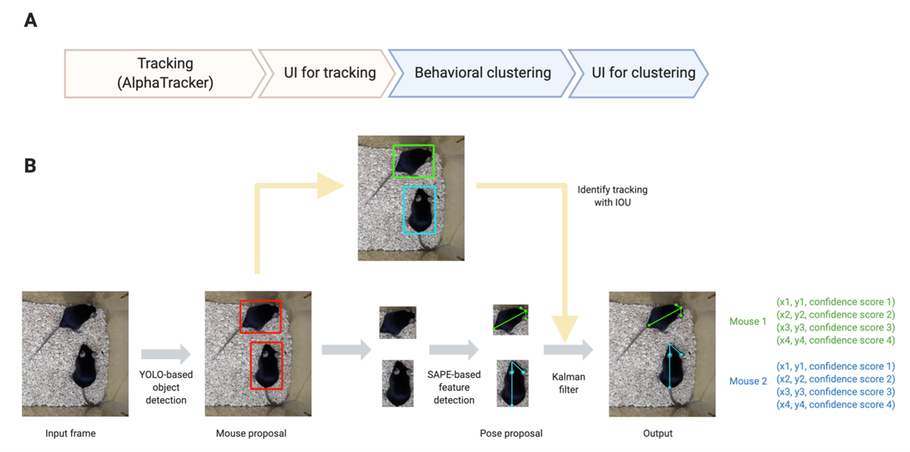

## AlphaTracker

    

[AlphaTracker](https://github.com/ZexinChen/AlphaTracker) is a multi-animal tracking and behavioral analysis tool which incorporates **multi-animal tracking**, **pose estimation** and **unsupervised behavioral clustering** to empower system neuroscience research. Alphatracker achieves the state-of-art accuracy of multi-animal tracking which lays the foundation for stringent biological studies. Moreover, the minimum requirement for hardware (regular webcams) and efficient training procedure allows readily adoption by most neuroscience labs.

     
    Architecture and Pipeline of AlphaTracker

## Instructions

[Multi-animal Pose Estimation and Tracking](Manual/Tracking.md)

[Unsupervised Behavioral Clustering](Manual/BehavioralClustering.md)

[Tracking UI and Clustering UI](Manual/UI.md)

[Use on Google Colab](Manual/Colab.md)

 

## Reference

Nancy Padilla-Coreano, Kanha Batra, Makenzie Patarino et al. A cortical-hypothalamic circuit decodes social rank and promotes dominance behavior, 03 November 2020, PREPRINT (Version 1) available at Research Square [https://doi.org/10.21203/rs.3.rs-94115/v1]
